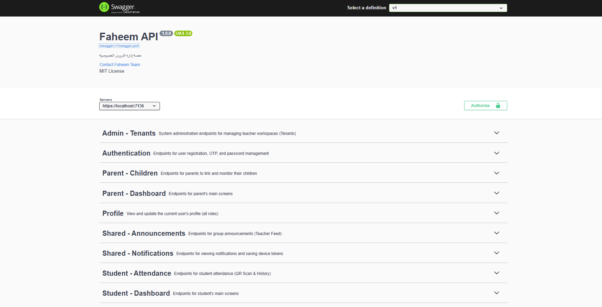
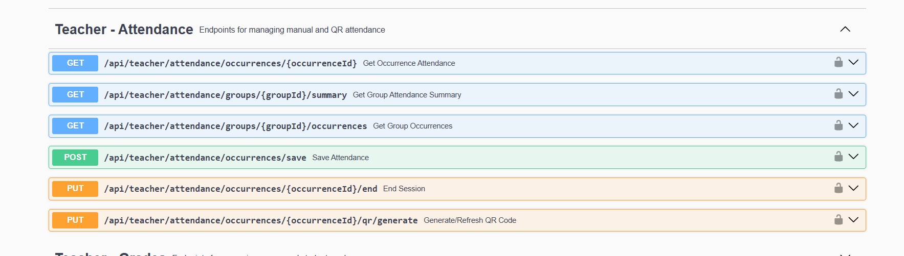
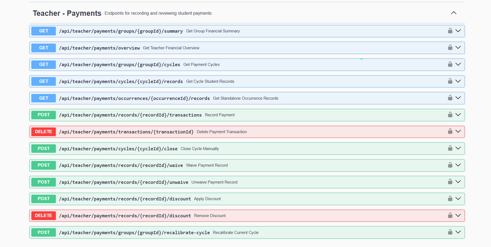

# Faheem

A multi-tenant tutoring management platform that helps teachers manage students, attendance, payments, exams, study materials, and parent communication from a single workspace.

Built with ASP.NET Core 8, Clean Architecture, CQRS, JWT Authentication, and SQL Server.

---

## Why Faheem?

Most private tutors manage their work through WhatsApp groups, paper records, and spreadsheets.

Faheem centralizes everything into one platform:

- Student Management
- Attendance Tracking
- QR Attendance
- Exams & Grades
- Payment Tracking
- Study Materials
- Parent Monitoring
- Push Notifications

## Teacher Features

- Create and manage study groups
- Schedule recurring sessions
- QR-code attendance
- Manual attendance tracking
- Student enrollment codes
- Upload study materials
- Create exams and record grades
- Track payments and installments
- Financial reports and summaries
- Send announcements
- Manage assistants

## Student Features

- Join groups using enrollment codes
- Scan QR codes for attendance
- View grades and exam results
- Access study materials
- View payment status
- Receive notifications

## Parent Features

- Link to children
- Monitor attendance
- Monitor grades
- Monitor payments
- Receive updates and notifications

## Architecture

Faheem follows Clean Architecture principles.

Domain
├── Entities
├── Business Rules

Application
├── CQRS
├── MediatR
├── Validation

Infrastructure
├── EF Core
├── Identity
├── Multi-Tenancy
├── Firebase
├── Email

WebAPI
├── Controllers
├── Middleware
├── Swagger

## Technical Highlights

### Multi-Tenant SaaS

Each teacher operates inside an isolated tenant workspace.

### JWT Security

- Access Tokens
- Refresh Token Rotation
- Refresh Token Reuse Detection

### QR Attendance System

Students can mark attendance using secure QR sessions.

### Financial System

Supports:

- Monthly subscriptions
- Per-session payments
- Partial payments
- Payment cycles
- Financial reporting

### Push Notifications

Firebase Cloud Messaging integration.

### Storage Abstraction

File storage abstraction ready for:
- Local Storage
- AWS S3
- Azure Blob Storage

## API Modules

Authentication
Profile
Announcements
Notifications

Teacher
├── Groups
├── Sessions
├── Attendance
├── Grades
├── Payments
├── Materials
└── Assistants

Student
├── Dashboard
├── Attendance
├── Grades
├── Materials
├── Payments
└── Enrollments

Parent
├── Dashboard
└── Children

Admin
└── Tenant Management

## API Documentation

Swagger UI

Attendance Module

Payments Module

## About

Faheem was designed to solve a real problem faced by private tutors:
managing students, attendance, grades, payments, and communication efficiently without relying on WhatsApp and spreadsheets.

The platform is currently deployed and actively evolving toward a full SaaS solution.
